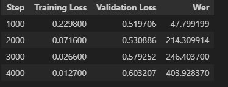
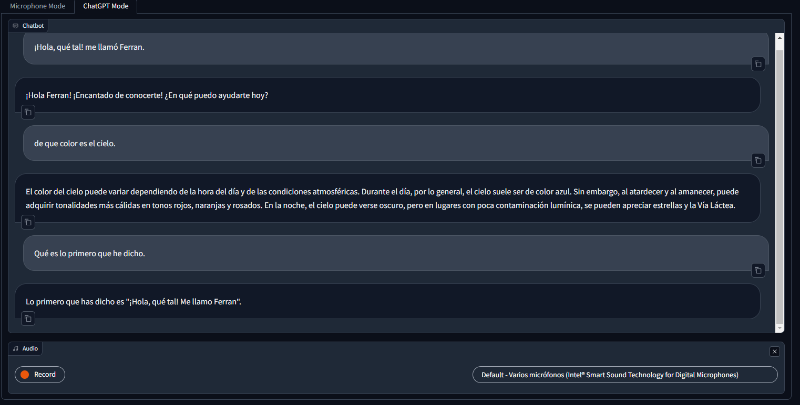

# Lab Description
The purpose of this lab is to fine-tune a pre-trained transformer model (Whisper) to transcribe audio from our mother tongue (Spanish).

## Assignment 1 

### Task 1 
This consisted of simply rerunning the code provided [here](spanish_fine_tune_whisper.ipynb) and changing the language to the mother tongue. We did this both in Spanish and Swedish.

### Task 2 
This task consisted of:
1. **Improving the model**: We improved it via model-centric approach (lower learning rate, higher max steps). We also did other experminets (e.g higher learning rate, lower steps) but found the first approach to be the best. (Best model: [here](https://huggingface.co/Potatoasdasdasdasda/whisper-base-es-improved-2))
2. Refactor the program into a [feature engineering pipeline](feature_extraction.py), [training pipeline](train.ipynb) and [inference program](whisper-spanish-conversation/app.py).

**Important Note**:

We were unable to store the spanish dataset because it's file size was over 500gb, which was **VERY BEYOND** Google Drive, Google Collab and even local storage. Therefore, we were not able to create a feature store. So we opted to using [streaming](https://huggingface.co/docs/datasets/stream), as is recommended by Huggingface. In order to demonstrate that we were able to create the feature enginnering step as taught in the course, we did it with Swedish by storing it locally: [here](swedish_fine_tune_whisper.ipynb)

We opted to using Spanish instead of Swedish because during the training of the Swedish model the WER oddly increased too much (upwards of 300%). As can be seen in the following image:

We implemented two different modes for the gradio application:
- **Microphone mode**: This mode allows the user to record a short spanish audio clip or upload an audio file. Then, the model will transcribe the audio and return the result. 
- **Conversation mode (Creative idea)**: This mode allows the user to have a conversation in spanish through the microphone. The model will transcribe the audio and return the result. Afterwards, GPT-3.5 will generate a response based on the transcription and the entire conversation history. 

To test the application with both versions go to: [Demo](https://huggingface.co/spaces/Potatoasdasdasdasda/whisper-spanish-conversation)

Example of conversation mode:
